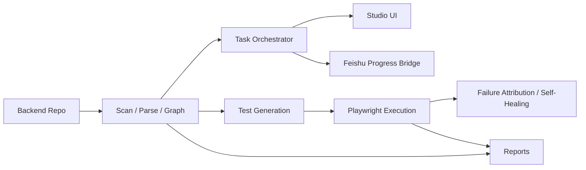

<p align="center">
  
</p>

<h1 align="center">OpenCroc</h1>

<p align="center">
  <strong>Turn any backend repo into a living graph, executable tasks, reports, and Feishu-visible progress.</strong>
</p>

<p align="center">
  <a href="https://www.npmjs.com/package/opencroc"></a>
  <a href="https://github.com/opencroc/opencroc/actions/workflows/ci.yml"></a>
  <a href="https://github.com/opencroc/opencroc/blob/main/LICENSE"></a>
  <a href="https://opencroc.com"></a>
</p>

<p align="center">
  <a href="README.md">简体中文</a> | <a href="README.en.md">English</a> | <a href="README.ja.md">日本語</a>
</p>

---

## Why OpenCroc?

OpenCroc puts repo understanding, task orchestration, test generation, execution, progress callbacks, and reporting into one toolchain so engineering, QA, product, and delivery teams can work from the same source-aware context.

## Core Features

- Source-aware scanning for modules, models, routes, DTOs, and dependency relationships
- Local Studio workspace for graph exploration, task tracking, agent activity, and runtime visibility
- Task-oriented execution model with stages, waiting states, summaries, and progress history
- Source-aware E2E generation built on top of [Playwright](https://playwright.dev)
- Failure attribution and controlled self-healing loops for generated test runs
- Feishu progress bridge for ACK, staged progress, waiting prompts, and completion callbacks
- HTML, JSON, and Markdown reports for engineering, product, and delivery review

## 5-Minute Quick Start

### Prerequisites

- Node.js 18+
- A backend repo you want to scan, generate against, or operate
- Install `@playwright/test` when you plan to execute generated tests

### 1) Install

```bash
npm install --save-dev opencroc @playwright/test
```

### 2) Initialize a config

```bash
npx opencroc init --yes
```

This creates a starter `opencroc.config.ts` for the current repo.

### 3) Run a first dry run

```bash
npx opencroc generate --all --dry-run
```

Use this to confirm OpenCroc can see your modules and generation path before writing files.

### 4) Start Studio

```bash
npx opencroc serve --host 0.0.0.0 --port 8765 --no-open
```

Open `http://127.0.0.1:8765` locally to inspect the workspace, tasks, and graph views.

### 5) Run the full loop

```bash
npx opencroc run --report html,json
```

After the first pass, you should have:

- generated artifacts under `opencroc-output/`
- a local Studio UI for graph and task inspection
- structured HTML and JSON reports

## Real Demo

### Demo: Feishu live progress smoke flow

If your immediate goal is to verify that task progress can reliably flow back to Feishu, start with this shortest path.

Minimal config:

```ts
import { defineConfig } from 'opencroc';

export default defineConfig({
  backendRoot: './backend',
  feishu: {
    enabled: true,
    mode: 'live',
    messageFormat: 'text',
    appId: process.env.FEISHU_APP_ID,
    appSecret: process.env.FEISHU_APP_SECRET,
    baseTaskUrl: 'http://127.0.0.1:8765',
    progressThrottlePercent: 15,
  },
});
```

Run the server:

```bash
npx opencroc serve --host 0.0.0.0 --port 8765 --no-open
```

Trigger the smoke flow:

```bash
curl -X POST http://127.0.0.1:8765/api/feishu/smoke/progress \
  -H 'content-type: application/json' \
  -d '{
    "chatId": "oc_xxx",
    "requestId": "om_xxx",
    "title": "Smoke test from local OpenCroc"
  }'
```

Expected behavior:

1. OpenCroc sends an immediate ACK or task-start message
2. OpenCroc sends staged progress updates
3. OpenCroc sends a final completion message

If this smoke flow works, your outbound Feishu callback path is alive and ready for more complex orchestration.

## Architecture



OpenCroc can be viewed as five connected layers:

- Ingest: scan source code, models, controllers, DTOs, and relationships
- Understand: build a knowledge graph and task-ready project context
- Orchestrate: turn analysis into executable tasks and staged progress
- Execute: generate tests, run them, observe failures, and repair in a controlled loop
- Surface: publish results through Studio, reports, and Feishu callbacks

## Scenario Examples

- Legacy backend onboarding: scan a large service and give new engineers an explorable graph instead of a folder dump
- Source-aware regression generation: generate Playwright cases from real backend structure before a release cut
- Delivery progress in chat: run a long task and send ACK, staged progress, and completion back to Feishu
- Architecture review: bring repo structure, module relationships, and generated reports into review meetings
- Runtime debugging: inspect tasks and agent activity in local Studio instead of stitching logs manually

## Comparison

| Dimension | OpenCroc | Playwright + hand-written scripts | Repo search / code QA tools | Internal dev portals |
| --- | --- | --- | --- | --- |
| Repo-to-graph understanding | Built in | Manual | Partial | Usually external |
| Task stages and progress model | Built in | Manual | Usually no | Partial |
| Source-aware test generation | Built in | Manual | No | No |
| Feishu progress callbacks | Built in | Manual integration | No | Rare |
| Local visual workspace | Built in | No | Partial | Usually yes |
| Failure attribution and self-healing | Built in | Manual | No | No |
| Best fit | Teams that want repo intelligence plus execution | Teams writing and maintaining every test by hand | Teams focused on code lookup and Q&A | Teams focused on service catalog and internal docs |

## Roadmap

- Current: Studio workspace, source-aware scanning, generation, reporting, and Feishu smoke progress are already in place
- Next: richer Feishu card interactions, stronger waiting and decision flows, better task summaries, and more polished Studio task views
- Later: more adapters, remote runners, multi-user workflows, and broader repo intelligence coverage

## More Docs

- [Architecture Guide](docs/architecture.md)
- [Configuration Reference](docs/configuration.md)
- [Backend Instrumentation Guide](docs/backend-instrumentation.md)
- [AI Provider Setup](docs/ai-providers.md)
- [Self-Healing Guide](docs/self-healing.md)
- [Troubleshooting](docs/troubleshooting.md)

## License

[MIT](LICENSE) Copyright 2026 OpenCroc Contributors
