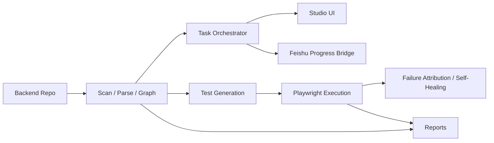

<p align="center">
  
</p>

<h1 align="center">OpenCroc</h1>

<p align="center">
  <strong>任意のバックエンドリポジトリを、理解できるグラフ、実行可能なタスク、共有できるレポート、そして Feishu で見える進捗に変える。</strong>
</p>

<p align="center">
  <a href="https://www.npmjs.com/package/opencroc"></a>
  <a href="https://github.com/opencroc/opencroc/actions/workflows/ci.yml"></a>
  <a href="https://github.com/opencroc/opencroc/blob/main/LICENSE"></a>
  <a href="https://opencroc.com"></a>
</p>

<p align="center">
  <a href="README.md">简体中文</a> | <a href="README.en.md">English</a> | <a href="README.ja.md">日本語</a>
</p>

---

## OpenCroc の価値

OpenCroc は、リポジトリ理解、タスク実行、テスト生成、進捗通知、レポート化を 1 本のツールチェーンにまとめ、開発、QA、プロダクト、デリバリーが同じソースコード文脈で動けるようにします。

## 主な機能

- ソースコード認識スキャンでモジュール、モデル、ルート、DTO、依存関係を把握
- ローカル Studio ワークスペースでグラフ、タスク、Agent 活動、実行状態を可視化
- ステージ、待機状態、要約、履歴を持つタスク指向の実行モデル
- [Playwright](https://playwright.dev) 上に構築されたソースコード認識型 E2E 生成
- 失敗の帰属分析と制御付き自己修復ループ
- ACK、段階進捗、待機通知、完了通知に対応した Feishu 進捗ブリッジ
- エンジニアリング、プロダクト、デリバリー向けの HTML、JSON、Markdown レポート

## 5 分クイックスタート

### 前提条件

- Node.js 18+
- スキャンまたは生成対象のバックエンドリポジトリ
- 生成したテストを実行する場合は `@playwright/test`

### 1) インストール

```bash
npm install --save-dev opencroc @playwright/test
```

### 2) 設定を初期化

```bash
npx opencroc init --yes
```

現在のリポジトリにスターター用 `opencroc.config.ts` を生成します。

### 3) まず dry-run

```bash
npx opencroc generate --all --dry-run
```

ファイルを書き出す前に、OpenCroc がモジュールと生成経路を正しく見えているか確認します。

### 4) Studio を起動

```bash
npx opencroc serve --host 0.0.0.0 --port 8765 --no-open
```

ローカルで `http://127.0.0.1:8765` を開き、ワークスペース、タスク、グラフを確認します。

### 5) 一連の流れを実行

```bash
npx opencroc run --report html,json
```

最初の実行後に得られるもの:

- `opencroc-output/` 配下の生成物
- グラフとタスクを見られるローカル Studio
- HTML と JSON の構造化レポート

## 実際の Demo

### Demo: Feishu ライブ進捗 smoke フロー

今いちばん確認したいことが「タスク進捗を Feishu に安定して返せるか」であれば、この最短ルートから始めるのが適切です。

最小構成:

```ts
import { defineConfig } from 'opencroc';

export default defineConfig({
  backendRoot: './backend',
  feishu: {
    enabled: true,
    mode: 'live',
    messageFormat: 'text',
    appId: process.env.FEISHU_APP_ID,
    appSecret: process.env.FEISHU_APP_SECRET,
    baseTaskUrl: 'http://127.0.0.1:8765',
    progressThrottlePercent: 15,
  },
});
```

サーバー起動:

```bash
npx opencroc serve --host 0.0.0.0 --port 8765 --no-open
```

smoke フロー実行:

```bash
curl -X POST http://127.0.0.1:8765/api/feishu/smoke/progress \
  -H 'content-type: application/json' \
  -d '{
    "chatId": "oc_xxx",
    "requestId": "om_xxx",
    "title": "Smoke test from local OpenCroc"
  }'
```

期待される動作:

1. すぐに ACK またはタスク開始メッセージが届く
2. 段階的な進捗更新が届く
3. 最終的な完了メッセージが届く

この smoke フローが通れば、Feishu への出力コールバック経路は生きており、より複雑なタスク編成へ進めます。

## アーキテクチャ



OpenCroc は 5 つの層で捉えられます。

- Ingest: ソースコード、モデル、コントローラ、DTO、関連をスキャン
- Understand: ナレッジグラフとタスク実行向けの文脈を構築
- Orchestrate: 分析結果を実行可能タスクと段階進捗へ変換
- Execute: テスト生成、実行、失敗観測、制御付き修復を実施
- Surface: Studio、レポート、Feishu 通知として結果を可視化

## 利用シナリオ

- レガシー backend の引き継ぎ: 大規模サービスをスキャンし、フォルダ一覧ではなく探索できるグラフを新メンバーに渡す
- ソースコード認識型の回帰生成: リリース前に実際の backend 構造から Playwright ケースを生成する
- チャットでの進捗共有: 長時間タスクの ACK、段階進捗、完了を Feishu に返す
- アーキテクチャレビュー: リポジトリ構造、モジュール関係、生成レポートをレビュー会に持ち込む
- 実行時デバッグ: ログを手でつなぐ代わりに、ローカル Studio でタスクと Agent を確認する

## 比較

| 観点 | OpenCroc | Playwright + 手書きスクリプト | コード検索 / Code QA ツール | 社内開発ポータル |
| --- | --- | --- | --- | --- |
| リポジトリからグラフへの理解 | 組み込み | 手作業 | 部分的 | 多くは外部依存 |
| タスク段階と進捗モデル | 組み込み | 手作業 | ほぼなし | 部分的 |
| ソースコード認識型テスト生成 | 組み込み | 手作業 | なし | なし |
| Feishu 進捗通知 | 組み込み | 別途実装 | なし | まれ |
| ローカル可視化ワークスペース | 組み込み | なし | 部分的 | 多くはあり |
| 失敗帰属と自己修復 | 組み込み | 手作業 | なし | なし |
| 向いているチーム | リポジトリ理解と実行を同時に進めたいチーム | 全テストを自前で保守したいチーム | コード検索と Q&A が主目的のチーム | サービス台帳や社内ドキュメント中心のチーム |

## Roadmap

- Current: Studio、ソースコード認識スキャン、生成、レポート、Feishu smoke 進捗は利用可能
- Next: より豊かな Feishu カード操作、待機と意思決定フロー、タスク要約、Studio タスク表示を強化
- Later: 追加アダプタ、リモートランナー、複数ユーザー協業、より広い repo intelligence へ拡張

## 追加ドキュメント

- [Architecture Guide](docs/architecture.md)
- [Configuration Reference](docs/configuration.md)
- [Backend Instrumentation Guide](docs/backend-instrumentation.md)
- [AI Provider Setup](docs/ai-providers.md)
- [Self-Healing Guide](docs/self-healing.md)
- [Troubleshooting](docs/troubleshooting.md)

## License

[MIT](LICENSE) Copyright 2026 OpenCroc Contributors
