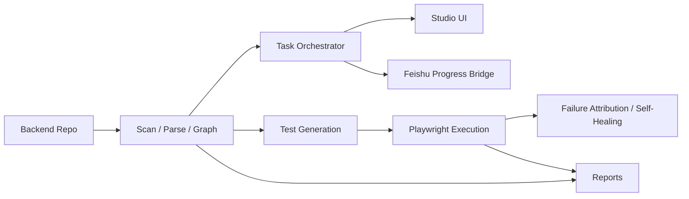

<p align="center">
  
</p>

<h1 align="center">OpenCroc</h1>

<p align="center">
  <strong>把任意后端仓库变成可理解的图谱、可执行的任务、可交付的报告，以及飞书里看得见的进度。</strong>
</p>

<p align="center">
  <a href="https://www.npmjs.com/package/opencroc"></a>
  <a href="https://github.com/opencroc/opencroc/actions/workflows/ci.yml"></a>
  <a href="https://github.com/opencroc/opencroc/blob/main/LICENSE"></a>
  <a href="https://opencroc.com"></a>
</p>

<p align="center">
  <a href="README.md">简体中文</a> | <a href="README.en.md">English</a> | <a href="README.ja.md">日本語</a>
</p>

---

## 一句话价值

OpenCroc 把“读仓库、拆任务、生成测试、执行验证、回传进度、沉淀报告”收进同一条工具链，让研发、测试、产品和交付围绕同一份源码上下文协作。

## 核心特性

- 源码感知扫描：识别模块、模型、路由、DTO 和依赖关系，不再只靠目录名猜结构
- 本地 Studio 工作台：在一个 Web 界面里查看图谱、任务、Agent 活动和运行状态
- 任务化执行模型：每个任务都有阶段、等待态、摘要和进度历史，适合长链路操作
- 基于源码的 E2E 生成：在 [Playwright](https://playwright.dev) 之上生成更贴近真实后端结构的测试资产
- 失败归因与受控自愈：失败后可以定位链路原因、给出修复建议并在受控条件下重试
- 飞书进度桥接：支持 ACK、阶段进度、等待决策和完成回传
- 多格式报告输出：支持 HTML、JSON、Markdown，方便工程、产品和交付对齐

## 5 分钟快速开始

### 前置要求

- Node.js 18+
- 一个你想扫描或生成测试的后端仓库
- 如果你准备执行生成后的测试，请先安装 `@playwright/test`

### 1) 安装

```bash
npm install --save-dev opencroc @playwright/test
```

### 2) 初始化配置

```bash
npx opencroc init --yes
```

这会在当前仓库创建一个起步版 `opencroc.config.ts`。

### 3) 先做一次 dry-run

```bash
npx opencroc generate --all --dry-run
```

先确认 OpenCroc 能否正确识别模块和生成路径，再决定是否真正落盘。

### 4) 启动 Studio

```bash
npx opencroc serve --host 0.0.0.0 --port 8765 --no-open
```

本机打开 `http://127.0.0.1:8765`，查看图谱、任务和运行状态。

### 5) 跑完整闭环

```bash
npx opencroc run --report html,json
```

第一次跑完后，你应该能得到：

- `opencroc-output/` 下的生成产物
- 一个可视化的本地 Studio
- 可导出的 HTML、JSON 报告

## 一个真实 Demo

### Demo：飞书实时进度 smoke 测试

如果你现在最关心的是“任务进度能不能稳定回到飞书”，先跑这条最短路径。

最小配置：

```ts
import { defineConfig } from 'opencroc';

export default defineConfig({
  backendRoot: './backend',
  feishu: {
    enabled: true,
    mode: 'live',
    messageFormat: 'text',
    appId: process.env.FEISHU_APP_ID,
    appSecret: process.env.FEISHU_APP_SECRET,
    baseTaskUrl: 'http://127.0.0.1:8765',
    progressThrottlePercent: 15,
  },
});
```

启动服务：

```bash
npx opencroc serve --host 0.0.0.0 --port 8765 --no-open
```

触发 smoke：

```bash
curl -X POST http://127.0.0.1:8765/api/feishu/smoke/progress \
  -H 'content-type: application/json' \
  -d '{
    "chatId": "oc_xxx",
    "requestId": "om_xxx",
    "title": "Smoke test from local OpenCroc"
  }'
```

预期结果：

1. 立即收到 ACK / 任务开始消息
2. 收到多次阶段进度更新
3. 收到最终完成消息

如果这条 smoke 流程可用，说明 OpenCroc 的飞书出站回传链路已经打通，可以继续接复杂任务编排。

## 架构图



OpenCroc 当前可以理解成 5 层：

- Ingest：扫描源码、模型、控制器、DTO 和关系
- Understand：构建知识图谱和任务可用的项目上下文
- Orchestrate：把分析结果组织成可执行任务和阶段进度
- Execute：生成测试、执行、观测失败并做受控修复
- Surface：通过 Studio、报告和飞书把结果呈现出来

## 场景示例

- 旧系统接手：先把大型后端服务扫成图谱，给新同学一个能探索的结构视图
- 回归生成：发布前根据真实源码结构生成 Playwright 用例，减少手写测试压力
- 飞书进度回传：长任务执行时，在群里持续看到 ACK、阶段进度和完成状态
- 架构评审：把仓库结构、模块关系和生成报告带进评审会，而不是只看目录树
- 运行态排障：在本地 Studio 里看任务和 Agent 活动，而不是手工拼日志

## 跟竞品对比

| 维度 | OpenCroc | Playwright + 手写脚本 | 代码搜索 / Code QA 工具 | 内部研发门户 |
| --- | --- | --- | --- | --- |
| 仓库到图谱的理解 | 内建 | 手工维护 | 局部 | 通常依赖外部系统 |
| 任务阶段和进度模型 | 内建 | 手工维护 | 通常没有 | 部分具备 |
| 基于源码的测试生成 | 内建 | 手工维护 | 不支持 | 不支持 |
| 飞书进度回传 | 内建 | 需要自行集成 | 不支持 | 少见 |
| 本地可视化工作台 | 内建 | 没有 | 局部 | 通常有 |
| 失败归因和自愈 | 内建 | 手工处理 | 不支持 | 不支持 |
| 最适合谁 | 既要理解仓库又要执行任务的团队 | 愿意手写并维护所有测试的团队 | 主要做代码检索和问答的团队 | 主要做目录、服务台账和内部文档的团队 |

## Roadmap

- 当前：Studio 工作台、源码扫描分析、基于源码的生成、报告输出和飞书 smoke 进度已可用
- 下一步：补强飞书卡片交互、等待态决策流、任务摘要质量和 Studio 任务视图
- 后续：扩展更多适配器、远程执行器、多用户协作和更完整的仓库智能能力

## 更多文档

- [架构说明](docs/architecture.md)
- [配置参考](docs/configuration.md)
- [后端埋点指南](docs/backend-instrumentation.md)
- [AI Provider 配置](docs/ai-providers.md)
- [自愈机制说明](docs/self-healing.md)
- [故障排查](docs/troubleshooting.md)

## License

[MIT](LICENSE) Copyright 2026 OpenCroc Contributors
